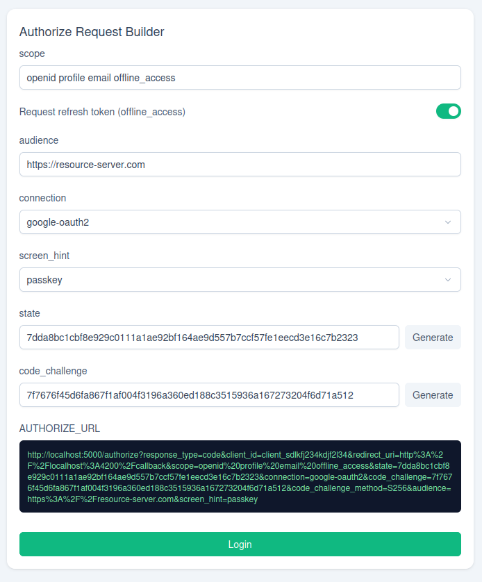
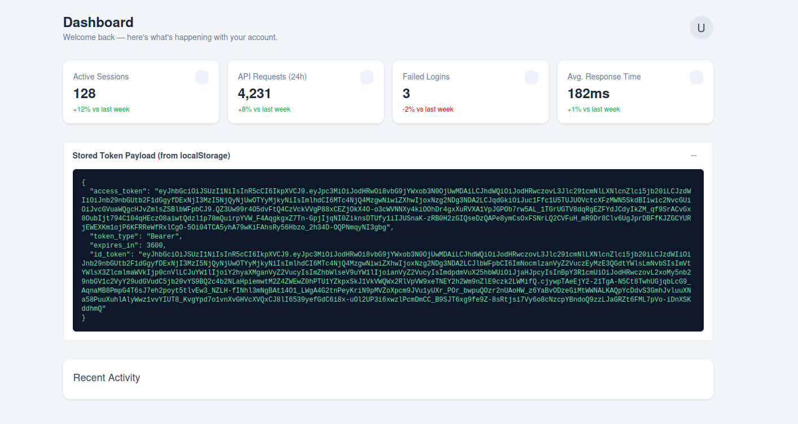

# CheckPointOne Demo Client

## Tech Stack

- Angular (standalone components)
- Tailwind CSS
- PrimeNG (dashboard screen)

## Running with Docker

The app is built and served via Docker on `localhost:4200`.

```bash
docker build -t oauth2-demo-client .
docker run -d --name oauth2-demo-client -p 4200:4200 oauth2-demo-client
```

Then open `http://localhost:4200`. This assumes the OAuth authorization server is running locally at `http://localhost:5000`.

## Example Flow

1. **Generate a live authorize URL** on the home page, then click **Login** to continue authorization. This does a full-page redirect to the authorize endpoint (`http://localhost:5000/authorize?...`).

   

2. **Redirected to Google** — since the authorize request specifies `connection=google-oauth2`, the auth server hands off to Google's sign-in screen.
3. **Sign in** with a Google account. Google redirects back to the auth server, which redirects the browser to `http://localhost:4200/callback?code=...&state=...`.
4. The **Callback** page reads the `code` from the query params and exchanges it for a token via `POST http://localhost:5000/oauth/token`. On success, the full token response is saved to `localStorage` and the app navigates to `/dashboard`.
5. On the **Dashboard**, copy the `access_token` or `id_token` value out of the "Stored Token Payload" panel and paste it into [jwt.io](https://jwt.io) to inspect the decoded claims.



You can find and run the oauth server here:
https://github.com/cjurgens17/checkpointone-oauth-server
